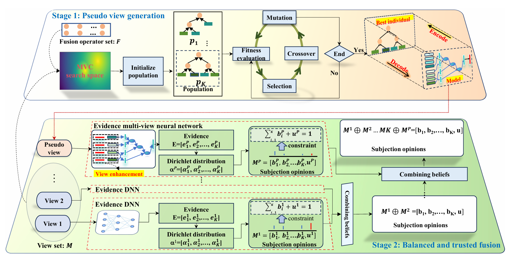

# TEF: Trusted Multi-view Classification via Evolutionary Multi-view Fusion

[](https://openreview.net/pdf?id=M3kBtqpys5)
[](https://github.com/fupinhan123/TEF)
[](https://www.python.org/)
[](https://pytorch.org/)
[](https://opensource.org/licenses/MIT)

## 📋 Abstract

Multi-view classification based on the Dempster-Shafer theory is widely recognized for its reliability in safety-critical domains with multi-view data. However, the adoption of a late fusion strategy constrains information interaction among views, thereby leading to suboptimal utilization of multi-view data. A recent advancement addressing this limitation involves generating a pseudo view by concatenating individual views. Yet, the efficacy of this pseudo view may diminish when incorporating underperforming views like noisy views. Additionally, the integration of a pseudo view exacerbates the issue of imbalanced multi-view learning, as it contains a disproportionate amount of information compared to individual views.

To address these issues, we propose the enhancing **Trusted multi-view classification via Evolutionary multi-view Fusion (TEF)** approach. TEF employs an evolutionary multi-view architecture search method to create a high-quality fusion architecture serving as the pseudo view, facilitating adaptive view and fusion operator selection. Furthermore, TEF enhances each view within the fusion architecture by concatenating the fusion architecture's decision output with its respective view.

## 🏗️ Model Architecture

<div align="center">
  
</div>

## 🌟 Key Contributions

1. **Evolutionary Pseudo View Generation**: The pseudo view generation is formulated as a population-based multi-view neural architecture search problem where higher-quality views can be automatically selected and fused with selected fusion operators from a candidate set.

2. **View Enhancement Strategy**: From the perspective of view enhancement, we propose a simple yet effective strategy to deal with the issue of imbalanced multi-view learning that is raised by a disproportionate amount of information between pseudo view and individual views.

3. **Superior Performance**: Extensive evaluations across 13 multi-view datasets validate the superior performance of our proposed method compared to other trusted multi-view learning approaches.

## 🏗️ Project Structure

```
TEF_Main/
│
├── 📁 data/                   # Data directory for storing datasets
│
├── 📁 datasets/               # Dataset loaders and preprocessing utilities
│   ├── 📄 nus_wide.py        # NUS-WIDE dataset loader
│   ├── 📄 mvoxceleb.py       # MVoxCeleb dataset loader
│   ├── 📄 reuters.py         # Reuters dataset loader
│   ├── 📄 awa.py             # Animals with Attributes loader
│   └── 📄 youtube_face.py    # YouTube Face dataset loader
│
├── 📁 models/                 # Model architectures
│   ├── 📄 TEF.py             # Main TEF model implementation
│
├── 📁 utils/                  # Utility functions
│   ├── 📄 utils.py           # General utilities (seed, checkpoint, logging)
│   └── 📄 logger.py          # Logging functionality and metrics tracking
│
├── 📄 __init__.py            # Package initialization
├── 📄 metrics.py             # Evaluation metrics (accuracy, precision, recall, F1, kappa)
└── 📄 Train_NUS.py           # Training script for NUS-WIDE dataset
```

## 🚀 Getting Started

### Prerequisites

- Python 3.7 or higher
- PyTorch 1.8.0 or higher
- CUDA 10.2+ (for GPU support)
- 16GB+ GPU memory recommended

### Installation

```bash
# Clone the repository
git clone https://github.com/fupinhan123/TEF.git
cd TEF_Main

# Create virtual environment (recommended)
python -m venv tef_env
source tef_env/bin/activate  # On Windows: tef_env\Scripts\activate

# Install PyTorch (adjust for your CUDA version)
pip install torch==1.8.0+cu111 torchvision==0.9.0+cu111 -f https://download.pytorch.org/whl/torch_stable.html

# Install other dependencies
pip install numpy scikit-learn tqdm
```

### Quick Start

#### Basic Training

```bash
python Train_NUS.py \
    --batch_sz 64 \
    --max_epochs 500 \
    --lr 1e-3 \
    --data_path ./data/nus_wide/ \
    --n_classes 10 \
    --gpu_device 0
```

#### Advanced Training with Custom Configuration

```bash
python Train_NUS.py \
    --batch_sz 128 \
    --max_epochs 1000 \
    --lr 5e-4 \
    --lr_factor 0.3 \
    --lr_patience 20 \
    --hidden 256 128 64 \
    --dropout 0.5 \
    --gradient_accumulation_steps 4 \
    --patience 150 \
    --annealing_epoch 20 \
    --seed 42
```


## 📊 Datasets

### Supported Datasets

| Dataset         | Views | Samples | Classes | Description                       |
| --------------- | ----- | ------- | ------- | --------------------------------- |
| **AWA**         | 7     | 30,475  | 50      | Animals with Attributes           |
| **NUS-WIDE**    | 7     | 23,438  | 10      | Multi-view image dataset          |
| **Reuters**     | 5     | 111,740 | 6       | Multilingual text dataset         |
| **MVoxCeleb**   | 5     | 153,516 | 1,251   | Audio-visual speaker verification |
| **YoutubeFace** | 5     | 101,499 | 31      | Face video dataset                |

### Dataset Features

#### AWA (Animals with Attributes)

- **View 1**: Color Histogram (CH) - 2,688 dimensions
- **View 2**: Local Self-Similarity (LSS) - 2,000 dimensions
- **View 3**: Pyramid HOG (PHOG) - 252 dimensions
- **View 4**: SIFT - 2,000 dimensions
- **View 5**: SURF - 2,000 dimensions
- **View 6**: rgSIFT - 2,000 dimensions
- **View 7**: ResNet101 - 2,048 dimensions

#### NUS-WIDE

- **View 1**: Color Histogram (CH) - 64 dimensions
- **View 2**: Color Moments (CM) - 225 dimensions
- **View 3**: Color Correlogram (CORR) - 144 dimensions
- **View 4**: Edge Direction Histogram (EDH) - 73 dimensions
- **View 5**: Wavelet Texture (WT) - 128 dimensions
- **View 6**: Bag of Words (BoW) - 500 dimensions
- **View 7**: Tags - 1,000 dimensions

### Dataset Preparation

1. Download datasets from the provided links
2. Extract to the `data/` directory
3. Directory structure should be:

```
data/
├── nus_wide/
│   ├── train/
│   └── test/
├── awa/
│   ├── train/
│   └── test/
└── ...
```

## ⚙️ Configuration

### Training Parameters

```python
# Core Training Parameters
BATCH_SIZE = 64                # Batch size for training
MAX_EPOCHS = 500               # Maximum number of training epochs
LEARNING_RATE = 1e-3           # Initial learning rate
WEIGHT_DECAY = 1e-5            # Weight decay for regularization
GRADIENT_ACCUMULATION = 3      # Gradient accumulation steps

# Model Architecture Parameters
HIDDEN_DIM = 768               # Hidden layer dimension
IMG_HIDDEN_DIM = 512          # Image hidden layer dimension
DROPOUT = 0.3                  # Dropout rate
INCLUDE_BN = True             # Include batch normalization

# Learning Rate Scheduler
LR_FACTOR = 0.3               # Factor for reducing learning rate
LR_PATIENCE = 20              # Patience for LR scheduler

# Early Stopping
PATIENCE = 100                # Early stopping patience
ANNEALING_EPOCH = 20          # Annealing epochs for loss

# Evolutionary Algorithm Parameters
POPULATION_SIZE = 28          # Population size for evolution
MAX_GENERATIONS = 20          # Maximum generations
CROSSOVER_PROB = 0.9         # Crossover probability
MUTATION_PROB = 0.2          # Mutation probability

# View Configuration (Example for NUS-WIDE)
VIEW_DIMS = [64, 225, 144, 73, 128, 500, 1000]

# Fusion Operators
FUSION_OPERATORS = ['Add', 'Mul', 'Cat', 'Max', 'Avg', 
                   'MLB', 'MFB', 'TFN', 'LMF', 'PTP']
```

### Command Line Arguments

| Parameter                       | Type  | Default         | Description             |
| ------------------------------- | ----- | --------------- | ----------------------- |
| `--batch_sz`                    | int   | 64              | Batch size              |
| `--max_epochs`                  | int   | 500             | Maximum training epochs |
| `--lr`                          | float | 1e-3            | Learning rate           |
| `--lr_factor`                   | float | 0.3             | LR reduction factor     |
| `--lr_patience`                 | int   | 20              | LR scheduler patience   |
| `--hidden`                      | list  | [128]           | Hidden layer dimensions |
| `--hidden_sz`                   | int   | 768             | Hidden layer size       |
| `--img_hidden_sz`               | int   | 512             | Image hidden size       |
| `--dropout`                     | float | 0.3             | Dropout rate            |
| `--n_classes`                   | int   | 10              | Number of classes       |
| `--patience`                    | int   | 100             | Early stopping patience |
| `--annealing_epoch`             | int   | 20              | Annealing epochs        |
| `--data_path`                   | str   | ./data/nyud2/   | Dataset path            |
| `--savedir`                     | str   | /data/TEF-Main/ | Save directory          |
| `--seed`                        | int   | 1               | Random seed             |
| `--gpu_device`                  | int   | 1               | GPU device ID           |
| `--n_workers`                   | int   | 12              | Data loading workers    |
| `--gradient_accumulation_steps` | int   | 3               | Gradient accumulation   |

## 📈 Experimental Results

### Performance Comparison

#### Accuracy Results (Mean ± Std)

| Method         | AWA            | NUS            | Reuters5       | Reuters3       | VoxCeleb       | YoutubeFace    |
| -------------- | -------------- | -------------- | -------------- | -------------- | -------------- | -------------- |
| TMC (ICLR22)   | 88.59±0.25     | 72.73±0.30     | 79.60±0.56     | 84.23±0.35     | 73.13±0.15     | 71.18±2.27     |
| TMOA (AAAI22)  | 89.17±0.31     | 72.60±0.48     | 79.11±0.43     | 84.19±0.27     | 84.72±0.21     | 84.35±0.25     |
| ETMC (TPAMI23) | 88.24±0.17     | 73.05±0.67     | 79.80±0.41     | 84.25±0.42     | 88.70±0.15     | 79.63±1.89     |
| RCML (AAAI24)  | 89.06±0.21     | 72.53±0.55     | 81.39±0.18     | 85.88±0.29     | 80.51±0.41     | 81.95±0.20     |
| **TEF (Ours)** | **93.26±1.25** | **75.12±0.57** | **82.26±0.23** | **86.49±0.10** | **92.41±0.12** | **86.02±0.41** |

### Trustworthiness Analysis

| Dataset     | TMC         | ETMC        | TEF (Ours)      |
| ----------- | ----------- | ----------- | --------------- |
| AWA         | 0.461±0.008 | 0.494±0.013 | **0.763±0.046** |
| NUS         | 0.684±0.029 | 0.793±0.044 | **0.949±0.010** |
| Reuters5    | 0.908±0.011 | 0.842±0.015 | **0.959±0.002** |
| Reuters3    | 0.923±0.010 | 0.879±0.021 | **0.986±0.002** |
| YoutubeFace | 0.621±0.031 | 0.901±0.010 | **0.963±0.004** |

## 🔬 Model Architecture

### Two-Stage Framework

#### Stage 1: Pseudo View Generation

- **Evolutionary Neural Architecture Search**: Automatically searches for optimal fusion architecture
- **Adaptive Selection**: Selects high-quality views and appropriate fusion operators
- **Population-based Optimization**: Uses genetic algorithms for architecture evolution
- **Fitness Evaluation**: Evaluates architectures based on validation performance

#### Stage 2: Balanced and Trusted Fusion

- **View Enhancement**: Concatenates decision outputs with original views
- **Evidence Collection**: Uses Softplus activation for evidence extraction
- **Dirichlet Distribution**: Models uncertainty through Dirichlet parameters
- **Dempster's Combination**: Fuses multi-view opinions for trusted decisions

### Fusion Operators

- **Basic Operators**: Add, Multiply, Concatenate, Max pooling, Average pooling
- **Advanced Operators**: 
  - MLB (Multi-modal Low-rank Bilinear)
  - MFB (Multi-modal Factorized Bilinear)
  - TFN (Tensor Fusion Network)
  - LMF (Low-rank Multimodal Fusion)
  - PTP (Polynomial Tensor Pooling)

## 📊 Evaluation Metrics

The `metrics.py` module provides comprehensive evaluation:

```python
from metrics import get_results

# Calculate all metrics
accuracy, recall, precision, f1_score, kappa = get_results(targets, predictions)

# Individual metric functions also available
from metrics import accuracy_score, f1_score, cohen_kappa_score
```

## 📝 Citation

If you find this work helpful in your research, please consider citing:

```bibtex
@inproceedings{liang2025tef,
  title={Trusted Multi-view Classification via Evolutionary Multi-view Fusion},
  author={Liang, Xinyan and Fu, Pinhan and Qian, Yuhua and Guo, Qian and Liu, Guoqing},
  booktitle={International Conference on Learning Representations (ICLR)},
  year={2025},
  url={https://openreview.net/pdf?id=M3kBtqpys5}
}
```

## 👥 Authors

- **Xinyan Liang**<sup>1*</sup> - Equal contribution
- **Pinhan Fu**<sup>1*</sup> - Equal contribution
- **Yuhua Qian**<sup>1†</sup> - Corresponding author
- **Qian Guo**<sup>2</sup>
- **Guoqing Liu**<sup>1</sup>

<sup>1</sup>Institute of Big Data Science and Industry, Key Laboratory of Evolutionary Science Intelligence of Shanxi Province, Shanxi University  
<sup>2</sup>Shanxi Key Laboratory of Big Data Analysis and Parallel Computing, Taiyuan University of Science and Technology

## 🤝 Contributing

We welcome contributions to TEF! Please follow these steps:

1. Fork the repository
2. Create your feature branch (`git checkout -b feature/AmazingFeature`)
3. Commit your changes (`git commit -m 'Add some AmazingFeature'`)
4. Push to the branch (`git push origin feature/AmazingFeature`)
5. Open a Pull Request

## 📄 License

This project is licensed under the MIT License - see the [LICENSE](LICENSE) file for details.

## 🙏 Acknowledgments

This work was supported by:

- National Natural Science Foundation of China (Nos. 62306171, T2495251, 62406218)
- Science and Technology Major Project of Shanxi (No. 202201020101006)
- Fundamental Research Program of Shanxi Province (No. 202203021222183)

Special thanks to all contributors and the research community for their valuable feedback.

## 📧 Contact

For questions, issues, or collaborations:

- **Xinyan Liang**: liangxinyan48@163.com
- **Pinhan Fu**: fupinhan168@163.com
- **GitHub Issues**: [https://github.com/fupinhan123/TEF/issues](https://github.com/fupinhan123/TEF/issues)

## 🔗 Related Work

### Our Research Group

- [Evolutionary deep fusion method (IEEE TEVC 2021)](https://ieeexplore.ieee.org/document/9373673)
- [DC-NAS: Divide-and-conquer NAS (AAAI 2024)](https://ojs.aaai.org/index.php/AAAI/article/view/29281)
- [Core-structures-guided NAS (IJCAI 2024)](https://www.ijcai.org/proceedings/2024/0440.pdf)
- [CoMO-NAS (ACM MM 2024)](https://dl.acm.org/doi/10.1145/3664647.3681351)
- [EFB-EMVC (NeurIPS 2025)](https://github.com/LiShuailzn/Neurips-2025-EFB-EMVC)

### Related Papers

- Trusted Multi-view Classification (ICLR 2022)
- Trusted Multi-view Deep Learning with Opinion Aggregation (AAAI 2022)
- Trusted Multi-view Classification with Dynamic Evidential Fusion (TPAMI 2023)
- Reliable Conflictive Multi-view Learning (AAAI 2024)

---

<div align="center">
  <b>Institute of Big Data Science and Industry</b><br>
  Key Laboratory of Evolutionary Science Intelligence of Shanxi Province<br>
  Shanxi University<br>
  <br>
  ⭐ Star us on GitHub if this work helps your research!
</div>

